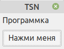

# NetBeans_wxWidgets_micro
Пример простейшей визуальной программы с wxWidgets на C++ в NetBeans 
с использованием wxFormBuilder для Linux



```
// ЭТО РЕАЛИЗАЦИЯ НАШЕГО МЕТОДА ОБРАБОТЧИКА СОБЫТИЯ НАЖАТИЯ НА КНОПКУ!
void MainFrame::myClick(wxCommandEvent& event) {
    wxMessageBox(wxT("wxWidgets - это круто!"));
}

// ЭТО НАША РЕАЛИЗАЦИЯ ОБРАБОТЧИКА ЗАКРЫТИЯ ФОРМЫ!
void MainFrame::OnCloseFrame(wxCloseEvent& event) {
    Destroy();
}
```
